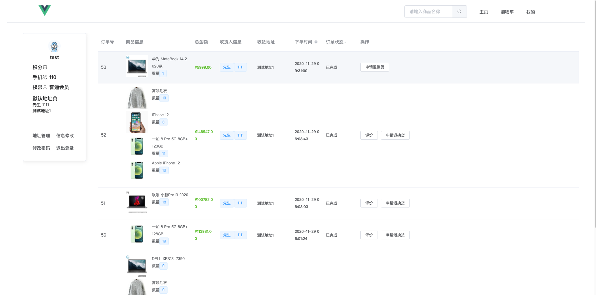

# ShopSystem


## 项目介绍
ShopSystem是一个简单的网络商城系统，前端基于Vue.Js + Element UI，后端基于SpringBoot + Mybatis。前台模块包括商品展示、商品搜索、订单模块、购物车、注册登录等，后台模块包括分类管理、商品管理、订单管理、用户管理等。采用`docker compose`容器编排部署。

### 前端演示图片




### Docker部署
安装`docker`与`docker compose`
- 克隆仓库
```
git clone https://github.com/shiroyk/ShopSystem.git
```
- 编译前端
```
cd frontend && npm install && npm run build && cd ..
```
- 编译后端<br>
```
cd shopsystem
mvn war
docker-compose build backend
```
- 启动
```
docker-compose up -d
```

### 后端API测试
使用API测试工具`Postman`导入项目下`ShopSystem.postman_collection.json`文件<br>
首先设置全局变量`baseurl`为`localhost:8080`<br>
然后访问/auth/login接口获取Token，用户名密码：
| 权限     | 用户名    | 密码      |
| -------- | --------- | --------- |
| 管理员   | admin     | admin     |
| 客服     | service   | service   |
| 仓库管理 | warehouse | warehouse |
| 一般用户 | test      | test      |


## 许可
Copyright (c) 2020 Shiroyk, All right reserved.
